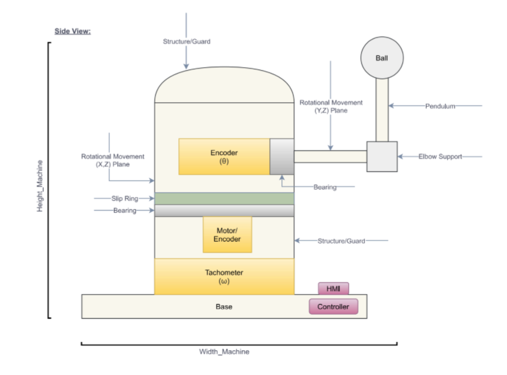
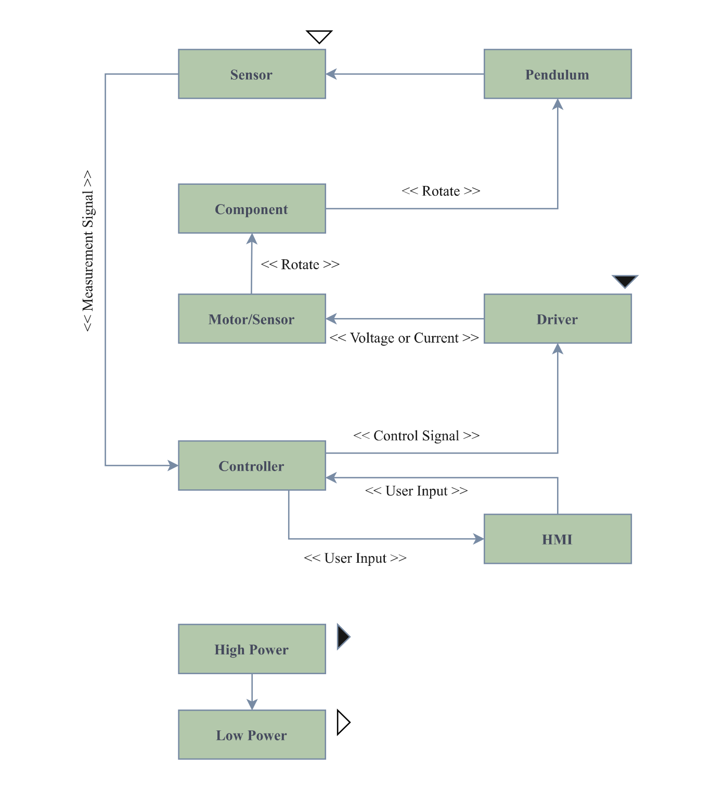
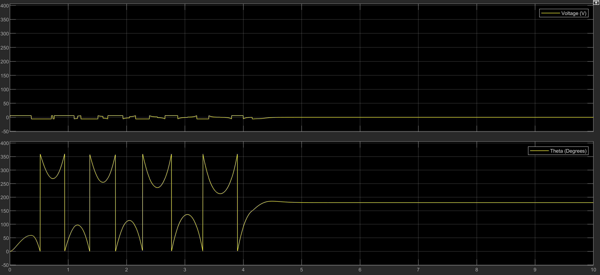

# Furuta-Pendulum-Group-1
# California State University, Chico 

Team Members: Ryan Calbert, Jarrel Cook, Michelle Gomez, Noah McCracken, Miguel Rodriguez 
<br/>
MECA 482: Fall 2021
<br/>
### Table of Contents:
1. Introduction 
2. System Requirements
3. Controller and Design and Simulations 
4. Model
5. Results
6. Appendix 

Presentation video click here.

### Introduction 

   In 2020 people worldwide were forced to remain inside, threatened by a global pandemic. With much more time on their hands, many turned to adapt pets to keep them company and busy. As a result of many new pet owners, pet toys and accessories are increasingly in demand. This page will review a prototype of an interactive cat toy. The toy's main component will be an inverted rotary pendulum, also known as a Furuta pendulum. The pendulum will react to a displacement caused by the animal, which allows for minimal human interaction. Along with the pendulum, the toy will have shielding to protect the animal and a textured ball to stimulate the cat's natural prey drive.

   A Furuta Pendulum consists of three main components, an electric DC motor and an arm for which the third component, the pendulum, is connected. As the system is initialized, the DC reacts to the pendulum's position and produces torque. The torque creates rotation of the arm in a horizontal plane. The pendulum is connected to the arm but can rotate freely in a vertical plane, with the arm as its focal point. The furuta pendulum is able to rotate and balance the arm in an upright position. The vertical arm is able to correct itself if a small displacement is applied to it, such as a cat hitting it. This allows for the furuta pendulum to be a great interactive cat toy. 

### System Requirements

Capabilities Database 
</p>
<p align="center">

</p>


Block Diagram 
</p>
<p align="center">

</p>
<br/>


Logical/functional Viewpoint 
</p>
<p align="center">

</p>
<br/>

### Controller and Design Simulations 

### Model
<p align="center">

</p>
   The main parameters of the diagram are as follows: 

* &theta;<sub>o</sub> is the angular position of the arm in radians.
* &theta;<sub>1</sub> is the angular position of the pendulum with respect to the pendulum in the downward position, in radians.
* &tau; is the torque coming from the electric motor.
* I<sub>o</sub> is the moment of inertia of the arm plus the motor inertia.
* L<sub>o</sub> is the length of the arm.
* m<sub>1</sub> is the pendulum mass.
* l<sub>1</sub> is the location of the center mass of the pendulum.
* J<sub>1</sub> is the moment of inertia.


### Results

<p align="center">

</p>

### Appendix A: MATLAB Code
```
g = 9.81;
% 1 - Arm
% 2 - Pendulum 

m1 = 0.380; 
m2 = 0.054;
L1 = 0.066; 
L2 = 0.146;  
M = 0.044;

J = 3.5256e-4; %3.5256e-04            %System
kb_p = 4.7940e-04 ;

kb_m = 6.75e-4 ;
ke = 0.5;
Re = 14.5;  %Medido

alpha = J + (M+m1/3+m2)*L1^2;
beta = (M + m2/3)*L2^2;
gamma = (M + m2/2)*L2*L1;
sigma = (M + m2/2)*g*L2;

%% Simulation parameters

initial_state = pi;
Ts = 0.001;
dtDisc = 0.01;
Reference = [0 0 0 0];
Zn = 3;   %Dead Zone

StepX = 10;
distrub = 12;
disturb = distrub*pi/180;

%% Linearization

% A matrix
A = zeros(4,4);
A(1,2) = 1;
A(2,3) = -(sigma*gamma)/(alpha*beta-gamma^2);
A(3,4) = 1;
A(4,3) = (alpha*sigma)/(alpha*beta-gamma^2);

% B matrix
B = zeros(4,2);
B(2,1) = beta/(alpha*beta-gamma^2);
B(2,2) = -gamma/(alpha*beta-gamma^2);
B(4,1) = -gamma/(alpha*beta-gamma^2);
B(4,2) = alpha/(alpha*beta-gamma^2);

% C matrix
C = [0 0 1 0;
     0 0 0 1];

%% Pseudo Linear System

% Pseudo A matrix
Ap = zeros(4,4);

Ap(1,2) = 1;

Ap(2,1) = 0;      Ap(2,2) = -B(2,1)*(ke^2/Re + kb_m); 
Ap(2,3) = A(2,3); Ap(2,4) = -B(2,2)*kb_p;

Ap(3,4) = 1;

Ap(4,1) = 0;      Ap(4,2) = -B(4,1)*(ke^2/Re + kb_m); 
Ap(4,3) = A(4,3); Ap(4,4) = -B(4,2)*kb_p;

% Pseudo B matrix

Bp = zeros(4,1);

Bp(2) = B(2,1)*ke/Re;  
Bp(4) = B(4,1)*ke/Re;   

% Controlability and Observability
Control = rank(ctrb(Ap,Bp));
Observ = rank(obsv(Ap,C));

% State Feedback Control

%K = place(Ap,Bp,[-5 -4 -2+2j -2-2j]);  
%K = place(Ap,Bp,[-8+8j -8-8j  -4+4j -4-4j]);


Q = [0.1 0 0 0;
     0 0.01 0 0;
     0 0 100 0;
     0 0 0 10];
R = 10;
[K, ~, E] = lqr(Ap,Bp,Q,R);

%K -0,4473 -1,3203 -33,3556 -3,0467
%K -0.2000   -1.1342  -30.9420   -3.2791  - Funciona pendulo 16/01

%% Down position (pi)

% Pseudo A matrix around pi
Ap2 = zeros(4,4);

Ap2(1,2) = 1;

Ap2(2,1) = 0;      Ap2(2,2) = -B(2,1)*(ke^2/Re + kb_m); 
Ap2(2,3) = A(2,3); Ap2(2,4) = B(2,2)*kb_p;

Ap2(3,4) = 1;

Ap2(4,1) = 0;      Ap2(4,2) = B(4,1)*(ke^2/Re + kb_m); 
Ap2(4,3) = -A(4,3); Ap2(4,4) = -B(4,2)*kb_p;

% Pseudo B matrix around pi

Bp2 = zeros(4,1);

Bp2(2) = B(2,1)*ke/Re;  
Bp2(4) = -B(4,1)*ke/Re;  

K2 = place(Ap2,Bp2,[-5 -4 -2+2j -2-2j]);
R2 = 1;
Q2=[1 0 0 0;
    0 10 0 0;
    0 0 1000 0;
    0 0 0 10];
[K2, ~, E] = lqr(Ap2,Bp2,Q2,R2);


view(135,20)                    %Starting view
AL = 5;                         %Define graph axis limits

grid on

L1=3;  %Rotatary arm length
L2=2;  %Pendulum length

Xh=[0 ; L1]';
Yh=[0 ; 0]';
Zh=[0 ; 0]';

Xv=[Xh(2) ; L1]';
Yv=[Yh(2) ; 0]';
Zv=[Zh(2) ; -L2]';

hold on
Harm  = fill3(Xh,Yh,Zh,'b'); 
Varm  = fill3(Xv,Yv,Zv,'g'); 

s=8;
M=scatter3(Xv(2),Yv(2),Zv(2),s,'filled','MarkerFaceColor','b','MarkerEdgeColor','k')


axis([-AL AL -AL AL -AL AL]);

theta=0;
phi=0;
c = [0 0 0];

TXT=title('Time: ')

for t=1:20:size(simTheta,1)
    TXT2=sprintf('Time:%.2f',simt(t));
    set(TXT,'String',TXT2);
    
    phi=simPhi(t);
    theta =-simTheta(t);
    
    Xh(2)= L1*cos(phi);
    Yh(2)=L1*sin(phi);
    
    Xva = 0;                
    Yva = L2*sin(theta);    
    Zva = -L2*cos(theta);   
    
    Xvb = Xva*cos(phi)-Yva*sin(phi)+L1*cos(phi);
    Yvb = Xva*sin(phi)+Yva*cos(phi) + L1*sin(phi);
    Zvb = Zva;
        
    
    Xv=[Xh(2);Xvb]';
    Yv=[Yh(2);Yvb]';
    Zv=[ 0   ;Zvb]';
    
    set(Harm,'XData',Xh);
    set(Harm,'YData',Yh);
    set(Harm,'ZData',Zh);
    %set(Harm,'FaceVertexCData',C);
    
    set(Varm,'XData',Xv);
    set(Varm,'YData',Yv);
    set(Varm,'ZData',Zv);
    %set(Varm,'FaceVertexCData',C);
    rem(t,30)
    


     %scatter3(Xv(2),Yv(2),Zv(2),s,'filled','MarkerFaceColor',c,'MarkerEdgeColor','k');
          
          
       
       
    
    set(M,'XData',Xv(2));
    set(M,'YData',Yv(2));
    set(M,'ZData',Zv(2));
    
    drawnow;

%     pause(0.0005); 
end
```
### References
